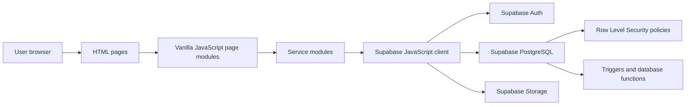
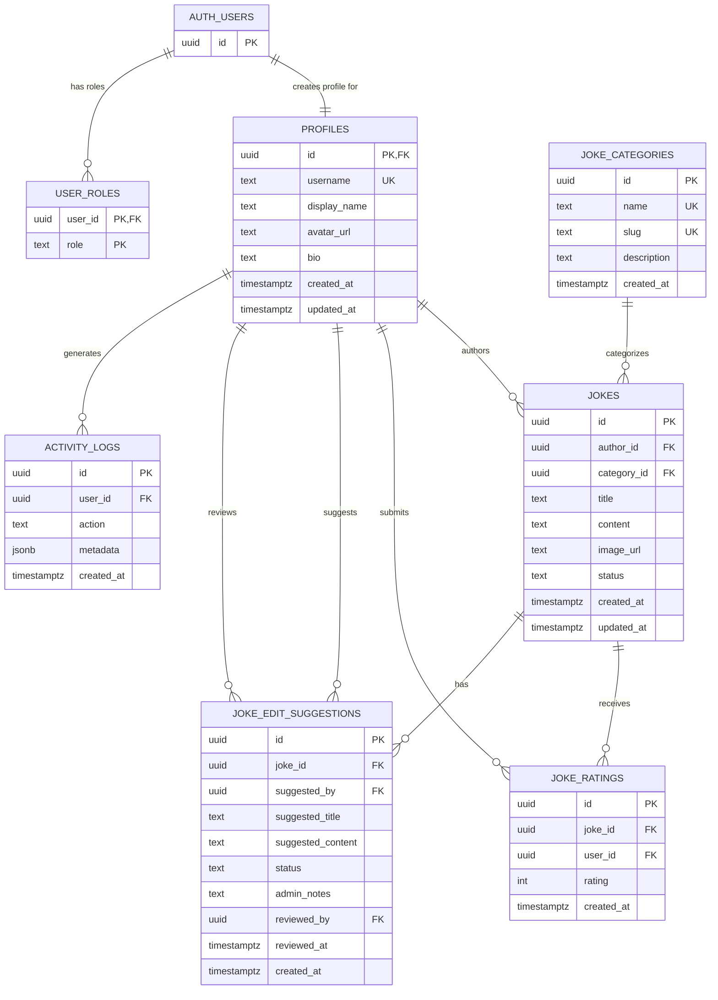
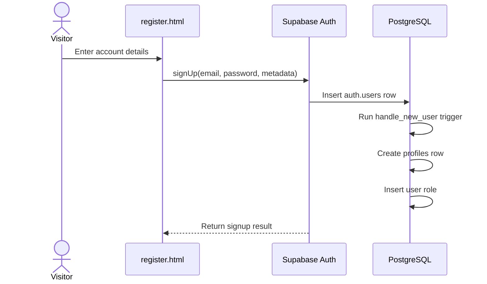
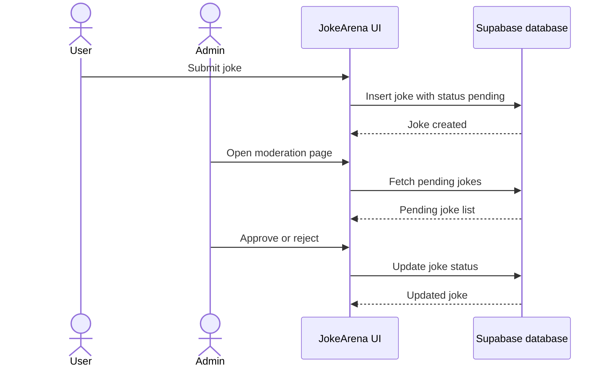
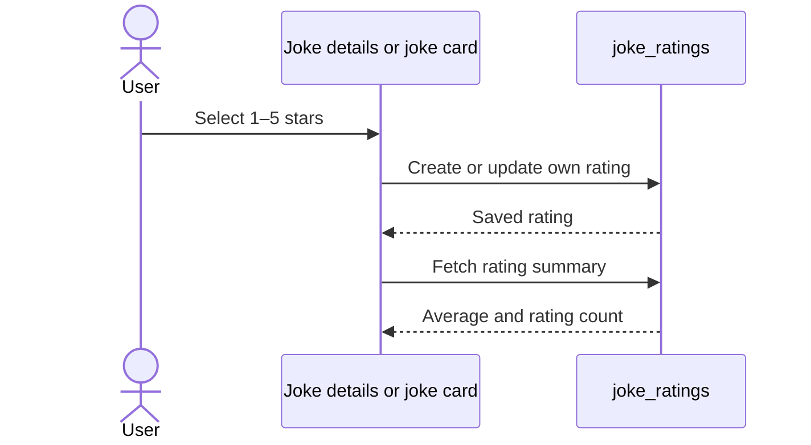

# JokeArena — Project Documentation

## Table of Contents

1. [Project Description](#1-project-description)
2. [User Roles and Permissions](#2-user-roles-and-permissions)
3. [System Architecture](#3-system-architecture)
4. [Technologies](#4-technologies)
5. [Application Pages](#5-application-pages)
6. [Database Schema](#6-database-schema)
7. [Database Relationships](#7-database-relationships)
8. [Database Security and Automation](#8-database-security-and-automation)
9. [Project Structure](#9-project-structure)
10. [Key Folders and Files](#10-key-folders-and-files)
11. [Main Application Flows](#11-main-application-flows)
12. [Local Development Setup](#12-local-development-setup)
13. [Build and Deployment](#13-build-and-deployment)
14. [Testing Checklist](#14-testing-checklist)

---

## 1. Project Description

**JokeArena** is a multi-page web application for publishing, browsing, rating, and moderating jokes.

The application uses a browser-based front end built with Vite, vanilla JavaScript, and Bootstrap. Supabase provides authentication, PostgreSQL data storage, file storage, and database-level authorization through Row Level Security.

The main purpose of the project is to provide a controlled joke-sharing platform where:

- guests can browse approved jokes and creator profiles;
- registered users can create jokes, rate jokes, update their profile, and manage jokes that they own;
- administrators can moderate joke submissions, manage categories, review edit suggestions, manage user roles, and inspect activity logs.

Only jokes with the status `approved` are displayed publicly.

---

## 2. User Roles and Permissions

### Guest user

A guest user can:

- view approved jokes;
- browse the latest jokes;
- browse top-rated jokes;
- browse jokes by category;
- open joke details;
- view public creator information;
- register;
- log in.

A guest user cannot:

- create jokes;
- rate jokes;
- edit profile information;
- access the administration page.

### Registered user

An authenticated user can:

- use all guest functionality;
- create a joke;
- upload an optional joke image;
- rate an approved joke from 1 to 5;
- update an existing rating;
- view and update their profile;
- upload or remove their avatar;
- view their own jokes;
- edit their own pending jokes;
- delete their own pending jokes.

New jokes are created with the status `pending`.

### Administrator

An administrator can:

- view pending and non-public jokes;
- approve or reject jokes;
- edit or delete jokes;
- review joke edit suggestions;
- add, update, and delete categories;
- assign or remove user roles;
- remove application data connected to a user;
- view activity logs.

Administrator access is determined through the `user_roles` table and the `public.is_admin()` database function.

### Permissions summary

| Operation | Guest | Registered user | Administrator |
|---|---:|---:|---:|
| View approved jokes | Yes | Yes | Yes |
| View creator profiles | Yes | Yes | Yes |
| Register and log in | Yes | Yes | Yes |
| Create a joke | No | Yes | Yes |
| Rate a joke | No | Yes | Yes |
| Update own profile | No | Yes | Yes |
| Edit own pending joke | No | Yes | Yes |
| Delete own pending joke | No | Yes | Yes |
| View all joke statuses | No | No | Yes |
| Approve or reject jokes | No | No | Yes |
| Manage categories | No | No | Yes |
| Manage user roles | No | No | Yes |
| View activity logs | No | No | Yes |

---

## 3. System Architecture

JokeArena follows a client-to-backend-service architecture.



### Front-end layer

The front end is composed of:

- separate HTML entry pages;
- page-specific JavaScript modules;
- reusable UI rendering utilities;
- reusable navigation and layout code;
- service modules that communicate with Supabase;
- Bootstrap styling and components;
- a shared custom stylesheet.

### Back-end layer

There is no separate custom Node.js server. Supabase acts as the application backend and provides:

- email/password authentication;
- PostgreSQL database;
- generated data API;
- Row Level Security;
- database functions and triggers;
- public storage buckets for avatars and joke images.

### Data-access layer

The files in `src/services/` isolate Supabase queries from the page modules. Page files call service functions rather than writing all database queries directly in the UI code.

---

## 4. Technologies

| Technology | Purpose |
|---|---|
| Vite `8.1.1` | Development server and production build |
| Vanilla JavaScript | Application logic and DOM updates |
| HTML5 | Multi-page application structure |
| CSS3 | Custom application styles |
| Bootstrap `5.3.8` | Responsive layout and UI components |
| `@supabase/supabase-js` `2.110.1` | Browser client for Supabase |
| Supabase Auth | User registration, login, session management |
| PostgreSQL | Relational database |
| Supabase Row Level Security | Database-level authorization |
| Supabase Storage | Avatar and joke image storage |
| SQL migrations | Reproducible database setup |

---

## 5. Application Pages

| Page | JavaScript module | Purpose |
|---|---|---|
| `index.html` | `src/pages/home.js` | Home page with categories, recent jokes, top-rated jokes, creators, and statistics |
| `login.html` | `src/pages/login.js` | User login |
| `register.html` | `src/pages/register.js` | New account registration |
| `create-joke.html` | `src/pages/create-joke.js` | Create a pending joke and optionally upload an image |
| `joke-details.html` | `src/pages/joke-details.js` | Display one approved joke and its rating controls |
| `edit-joke.html` | `src/pages/edit-joke.js` | Edit an owned pending joke or edit a joke as an administrator |
| `profile.html` | `src/pages/profile.js` | Display and update profile information and list user jokes |
| `admin.html` | `src/pages/admin.js` | Administration and moderation interface |
| `category-jokes.html` | `src/pages/category-jokes.js` | Display approved jokes from a selected category |
| `latest-jokes.html` | `src/pages/latest-jokes.js` | Paginated list of recently approved jokes |
| `top-rated.html` | `src/pages/top-rated.js` | Paginated list ordered by rating |
| `creators.html` | `src/pages/creators.js` | Paginated list of public creators |

---

## 6. Database Schema

The database contains seven application tables in the `public` schema. The `profiles` and `user_roles` tables are also connected to Supabase's internal `auth.users` table.

### Complete ER diagram



### Relationship tree

```text
auth.users
├── profiles
│   ├── jokes
│   │   ├── joke_ratings
│   │   └── joke_edit_suggestions
│   ├── joke_ratings
│   ├── joke_edit_suggestions
│   │   ├── suggested_by -> profiles.id
│   │   └── reviewed_by  -> profiles.id
│   └── activity_logs
└── user_roles

joke_categories
└── jokes
```

### 6.1 `profiles`

Stores the public application profile corresponding to a Supabase Auth user.

| Column | Type | Constraints / purpose |
|---|---|---|
| `id` | `uuid` | Primary key; references `auth.users.id`; deleted on auth-user deletion |
| `username` | `text` | Required and unique |
| `display_name` | `text` | Optional public display name |
| `avatar_url` | `text` | Optional public avatar URL |
| `bio` | `text` | Optional profile biography |
| `created_at` | `timestamptz` | Defaults to the current time |
| `updated_at` | `timestamptz` | Updated automatically by trigger |

### 6.2 `user_roles`

Stores application roles assigned to users.

| Column | Type | Constraints / purpose |
|---|---|---|
| `user_id` | `uuid` | References `auth.users.id`; part of the composite primary key |
| `role` | `text` | Part of the composite primary key; only `user` or `admin` |

A user can have more than one role row, although the current application uses the `user` and `admin` role values.

### 6.3 `joke_categories`

Stores the categories available when creating and browsing jokes.

| Column | Type | Constraints / purpose |
|---|---|---|
| `id` | `uuid` | Primary key; generated automatically |
| `name` | `text` | Unique category name |
| `slug` | `text` | Unique URL-friendly identifier |
| `description` | `text` | Category description |
| `created_at` | `timestamptz` | Defaults to the current time |

The migrations insert these categories:

- Programming
- Office
- School
- Food
- Dark Humor
- Animals
- Random

### 6.4 `jokes`

Stores joke submissions.

| Column | Type | Constraints / purpose |
|---|---|---|
| `id` | `uuid` | Primary key; generated automatically |
| `author_id` | `uuid` | References `profiles.id` |
| `category_id` | `uuid` | References `joke_categories.id` |
| `title` | `text` | Required |
| `content` | `text` | Required |
| `image_url` | `text` | Optional public image URL |
| `status` | `text` | `pending`, `approved`, or `rejected`; defaults to `pending` |
| `created_at` | `timestamptz` | Defaults to the current time |
| `updated_at` | `timestamptz` | Updated automatically by trigger |

### 6.5 `joke_ratings`

Stores ratings submitted by users.

| Column | Type | Constraints / purpose |
|---|---|---|
| `id` | `uuid` | Primary key; generated automatically |
| `joke_id` | `uuid` | References `jokes.id`; cascade delete |
| `user_id` | `uuid` | References `profiles.id`; cascade delete |
| `rating` | `int` | Value from 1 to 5 |
| `created_at` | `timestamptz` | Defaults to the current time |

The pair `(joke_id, user_id)` is unique, so one user can have only one rating per joke. Updating a rating changes the existing record instead of creating a duplicate.

### 6.6 `joke_edit_suggestions`

Stores proposed joke changes that require administrator review.

| Column | Type | Constraints / purpose |
|---|---|---|
| `id` | `uuid` | Primary key; generated automatically |
| `joke_id` | `uuid` | References `jokes.id`; cascade delete |
| `suggested_by` | `uuid` | References `profiles.id` |
| `suggested_title` | `text` | Proposed title |
| `suggested_content` | `text` | Proposed content |
| `status` | `text` | `pending`, `approved`, or `rejected`; defaults to `pending` |
| `admin_notes` | `text` | Optional moderation notes |
| `reviewed_by` | `uuid` | References the reviewing profile |
| `reviewed_at` | `timestamptz` | Review timestamp |
| `created_at` | `timestamptz` | Defaults to the current time |

### 6.7 `activity_logs`

Stores selected authenticated-user actions for administrator review.

| Column | Type | Constraints / purpose |
|---|---|---|
| `id` | `uuid` | Primary key; generated automatically |
| `user_id` | `uuid` | References `profiles.id`; set to `NULL` when the profile is deleted |
| `action` | `text` | Required action identifier |
| `metadata` | `jsonb` | Required structured metadata; defaults to `{}` |
| `created_at` | `timestamptz` | Required; defaults to the current time |

---

## 7. Database Relationships

| Source | Relationship | Target | Delete behavior |
|---|---|---|---|
| `profiles.id` | one-to-one | `auth.users.id` | Cascade |
| `user_roles.user_id` | many-to-one | `auth.users.id` | Cascade |
| `jokes.author_id` | many-to-one | `profiles.id` | No explicit cascade |
| `jokes.category_id` | many-to-one | `joke_categories.id` | No explicit cascade |
| `joke_ratings.joke_id` | many-to-one | `jokes.id` | Cascade |
| `joke_ratings.user_id` | many-to-one | `profiles.id` | Cascade |
| `joke_edit_suggestions.joke_id` | many-to-one | `jokes.id` | Cascade |
| `joke_edit_suggestions.suggested_by` | many-to-one | `profiles.id` | No explicit cascade |
| `joke_edit_suggestions.reviewed_by` | many-to-one | `profiles.id` | No explicit cascade |
| `activity_logs.user_id` | many-to-one | `profiles.id` | Set null |

---

## 8. Database Security and Automation

### Row Level Security

Row Level Security is enabled for:

- `profiles`
- `user_roles`
- `joke_categories`
- `jokes`
- `joke_ratings`
- `joke_edit_suggestions`
- `activity_logs`

### Main RLS rules

#### Profiles

- public and authenticated users can read profiles;
- authenticated users can insert, update, and delete only their own profile;
- administrators can manage all profiles.

#### User roles

- users can read their own roles;
- administrators can manage role assignments.

#### Categories

- everyone can read categories;
- only administrators can create, update, or delete categories.

#### Jokes

- guests and authenticated users can read only approved jokes;
- administrators can read and manage all jokes;
- authenticated users can create only pending jokes under their own user ID;
- users can update or delete only their own pending jokes.

#### Ratings

- everyone can read ratings;
- authenticated users can create, update, and delete only their own ratings;
- administrators can delete ratings.

#### Edit suggestions

- users can create suggestions under their own user ID;
- users can read their own suggestions;
- administrators can read, update, and delete all suggestions.

#### Activity logs

- authenticated users can insert logs only for themselves;
- only administrators can read activity logs.

### Database functions

#### `public.set_updated_at()`

Sets `updated_at` to the current timestamp before a row is updated.

It is used by triggers on:

- `profiles`
- `jokes`

#### `public.is_admin(user_id uuid)`

Returns `true` when the supplied user has an `admin` entry in `user_roles`.

This function is used inside RLS policies.

#### `public.handle_new_user()`

Runs after a new record is inserted into `auth.users`.

It automatically:

1. generates a unique username;
2. creates the related `profiles` row;
3. gives the new account the `user` role.

### Storage buckets

The project creates two public storage buckets:

| Bucket | Purpose |
|---|---|
| `avatars` | User profile avatars |
| `joke-images` | Optional joke images |

Public users can read the stored files. Authenticated users can upload files only into a folder whose first path segment matches their own user ID.

### Database indexes

Indexes are created for frequently filtered and sorted fields, including:

- joke author;
- joke category;
- joke status and creation time;
- rating joke and user IDs;
- profile creation time;
- category creation time;
- edit-suggestion joke, user, status, and creation time;
- activity-log user, action, and creation time.

---

## 9. Project Structure

```text
JokeArena/
├── .env
├── .env.example
├── .gitignore
├── README.md
├── package.json
├── package-lock.json
├── vite.config.js
│
├── index.html
├── login.html
├── register.html
├── create-joke.html
├── joke-details.html
├── edit-joke.html
├── profile.html
├── admin.html
├── category-jokes.html
├── latest-jokes.html
├── top-rated.html
├── creators.html
│
├── public/
│   ├── favicon.svg
│   └── icons.svg
│
├── src/
│   ├── assets/
│   │   ├── logo.png
│   │   └── logo_original.png
│   │
│   ├── components/
│   │   └── navbar.js
│   │
│   ├── pages/
│   │   ├── admin.js
│   │   ├── category-jokes.js
│   │   ├── create-joke.js
│   │   ├── creators.js
│   │   ├── edit-joke.js
│   │   ├── home.js
│   │   ├── joke-details.js
│   │   ├── latest-jokes.js
│   │   ├── login.js
│   │   ├── profile.js
│   │   ├── register.js
│   │   └── top-rated.js
│   │
│   ├── services/
│   │   ├── activityService.js
│   │   ├── adminService.js
│   │   ├── authService.js
│   │   ├── jokeService.js
│   │   ├── profileService.js
│   │   ├── ratingService.js
│   │   └── supabaseClient.js
│   │
│   ├── styles/
│   │   └── main.css
│   │
│   ├── utils/
│   │   ├── dom.js
│   │   ├── page-layout.js
│   │   └── rating-ui.js
│   │
│   └── main.js
│
└── supabase/
    ├── config.toml
    ├── seed.sql
    └── migrations/
        ├── 20260708000000_initial_backend_foundation.sql
        ├── 20260708_seed_jokearena_categories.sql
        ├── 20260709000001_public_profiles_select.sql
        ├── 20260709000002_storage_buckets.sql
        └── 20260709000003_activity_logs_and_admin_cleanup.sql
```

The `.env` file contains local secrets and must not be committed.

The `supabase/.temp/` directory is generated by the Supabase CLI and is not part of the application's source architecture.

---

## 10. Key Folders and Files

### Root HTML files

Each HTML file acts as a Vite entry point for one page. The page imports its corresponding JavaScript module from `src/pages/`.

### `src/pages/`

Contains page controllers. Each module:

- loads authentication state;
- fetches data through service modules;
- renders page content;
- binds forms and UI events;
- handles page-specific redirects and validation.

### `src/services/`

#### `supabaseClient.js`

Creates and exports the shared Supabase client using:

- `VITE_SUPABASE_URL`
- `VITE_SUPABASE_ANON_KEY`

#### `authService.js`

Handles:

- session retrieval;
- current user and profile lookup;
- profile creation fallback;
- role retrieval;
- registration;
- login;
- email and password changes;
- logout;
- logout-button binding.

#### `jokeService.js`

Handles:

- category retrieval;
- approved-joke lists and counts;
- category-based filtering;
- top-rated joke retrieval;
- joke details;
- user-owned joke retrieval;
- administrator joke retrieval;
- pending joke retrieval;
- edit suggestions;
- image upload and removal;
- joke creation;
- status updates;
- draft updates;
- joke deletion;
- edit-suggestion moderation.

#### `ratingService.js`

Handles:

- aggregate rating summaries;
- retrieving the current user's rating;
- creating or updating a rating.

#### `profileService.js`

Handles:

- profile retrieval;
- profile joke lists;
- profile updates;
- avatar upload and removal;
- public creator lists and counts.

#### `adminService.js`

Handles:

- administrator profile lists;
- user-role assignment;
- category creation, editing, and deletion;
- removal of user-related application data.

#### `activityService.js`

Writes and retrieves application activity-log records.

### `src/components/navbar.js`

Renders the shared navigation bar according to:

- active page;
- authentication state;
- administrator state;
- current profile.

### `src/utils/dom.js`

Contains reusable DOM and formatting helpers:

- HTML escaping;
- query-string parsing;
- date formatting;
- initials generation;
- document-title updates.

### `src/utils/page-layout.js`

Contains shared rendering functions for:

- the page shell;
- rating stars;
- joke cards;
- forms;
- statistics;
- moderation rows;
- categories;
- creator cards.

It also imports Bootstrap CSS, Bootstrap JavaScript, and the project stylesheet.

### `src/utils/rating-ui.js`

Binds interactive rating controls and connects them to `ratingService.js`.

### `src/styles/main.css`

Contains the project's custom visual styles.

### `supabase/migrations/`

Contains the ordered SQL changes required to reproduce:

- tables;
- relationships;
- functions;
- triggers;
- RLS policies;
- grants;
- indexes;
- storage buckets.

### `supabase/seed.sql`

Adds repeatable demo and starter data, including joke categories and joke records.

---

## 11. Main Application Flows

### Registration flow



### Joke submission and moderation flow



### Rating flow



---

## 12. Local Development Setup

### Requirements

Install:

- Node.js;
- npm;
- access to a Supabase project;
- optionally the Supabase CLI when applying migrations locally or to a linked project.

### 1. Clone the repository

```bash
git clone <repository-url>
cd JokeArena
```

### 2. Install dependencies

```bash
npm install
```

### 3. Configure environment variables

Copy the example file:

```bash
cp .env.example .env
```

Add the Supabase project values:

```env
VITE_SUPABASE_URL=https://your-project-ref.supabase.co
VITE_SUPABASE_ANON_KEY=your-public-anon-or-publishable-key
```

Only the public anonymous or publishable key belongs in browser code. A service-role key must never be stored in the front-end environment.

### 4. Apply database migrations

Using the Supabase CLI:

```bash
supabase login
supabase link --project-ref YOUR_PROJECT_REF
supabase db push
```

Alternatively, run the migration files in order through the Supabase SQL Editor.

### 5. Apply seed data

The repository includes:

```text
supabase/seed.sql
```

Run it when starter or demonstration data is required.

### 6. Start the development server

```bash
npm run dev
```

Open the local URL shown by Vite.

### Available commands

```bash
npm run dev
npm run build
npm run preview
```

| Command | Purpose |
|---|---|
| `npm run dev` | Start the Vite development server |
| `npm run build` | Create a production build |
| `npm run preview` | Preview the production build locally |

---

## 13. Build and Deployment

### Production build

```bash
npm run build
```

The generated static files can be deployed to a static hosting platform that supports a Vite multi-page application.

### Required deployment configuration

1. Add `VITE_SUPABASE_URL`.
2. Add `VITE_SUPABASE_ANON_KEY`.
3. Apply all SQL migrations to the target Supabase project.
4. Apply the storage-bucket migration.
5. Confirm that RLS policies are enabled.
6. Confirm that all HTML entry pages are included in the deployment.
7. Do not expose the Supabase service-role key.

---

## 14. Testing Checklist

### Authentication

1. Register a new user.
2. Confirm that the profile row is created automatically.
3. Confirm that the `user` role is assigned.
4. Log in.
5. Log out.
6. Confirm that protected pages redirect or deny access.

### Profile

1. Update display name and biography.
2. Upload an avatar.
3. Remove the avatar.
4. Confirm that the public creator list shows the profile.

### Joke creation and moderation

1. Create a joke as an authenticated user.
2. Confirm that its initial status is `pending`.
3. Confirm that it is not publicly visible.
4. Log in as an administrator.
5. Approve the joke.
6. Confirm that it appears on public pages.
7. Reject another joke and confirm that it remains hidden.

### Ownership rules

1. Edit an owned pending joke.
2. Attempt to edit another user's joke.
3. Confirm that the database policy blocks the operation.
4. Delete an owned pending joke.

### Ratings

1. Rate an approved joke from 1 to 5.
2. Change the rating.
3. Confirm that only one rating row exists for the user and joke.
4. Confirm that the displayed aggregate changes.

### Administration

1. Create a category.
2. Update the category.
3. Assign and remove an administrator role.
4. Review activity logs.
5. Confirm that a non-administrator cannot access administrator data.

---

## Summary

JokeArena is a Vite multi-page application with a Supabase backend. Its implemented architecture includes authentication, public profiles, roles, joke categories, joke moderation, ratings, edit suggestions, activity logging, image storage, database triggers, indexes, and Row Level Security.

This documentation describes only functionality and database structures present in the supplied project files and Supabase schema.
